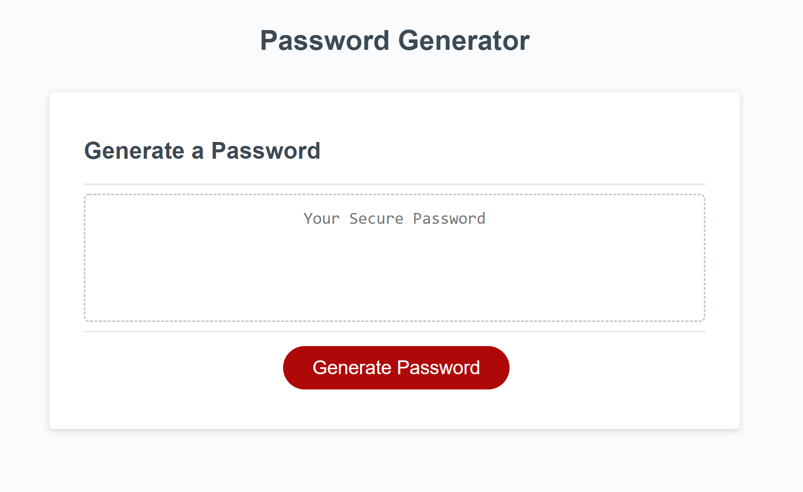

# Password Generator

## Installation
Minimal installation required. Project is deployed live at [Password Generator (https://alexcourtney18.github.io/Password-Generator/).]

## Usage
When user clicks generate password button, user is prompted to enter character length between 8-128 characters. After that they are prompted to confirm 4 different types of characters;
lower case letters, upper case letters, numbers, and special characters.

